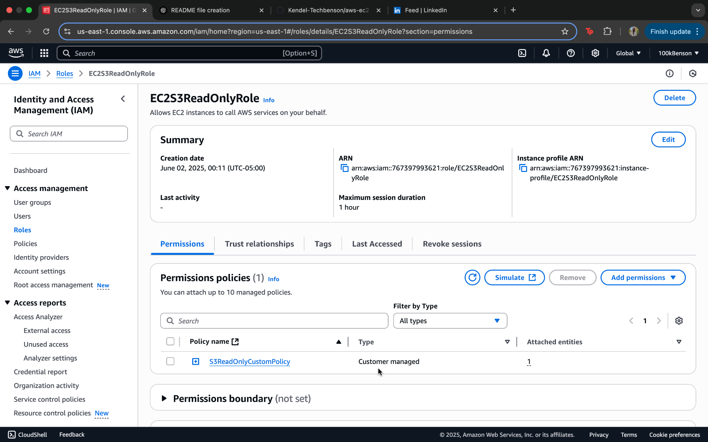

# AWS IAM Role to EC2 Lab

## 🔍 Summary

This lab demonstrates how to securely grant an EC2 instance permission to access AWS S3 buckets using IAM roles and policies. It covers custom policy creation, role assignment, EC2 launch, and access verification through the AWS CLI.

---

## ✅ What I Did

- Created a custom IAM policy allowing only S3 read/list access.
- Created an IAM role and attached the custom policy.
- Launched an EC2 instance with the IAM role attached.
- SSH’d into the EC2 instance using a `.pem` file.
- Verified permissions by listing S3 buckets from the EC2 instance using the AWS CLI.

---

## 🧠 Skills Learned

- Writing and assigning IAM policies using JSON
- IAM role creation and role-based access control
- EC2 instance provisioning with IAM roles
- SSH key pair authentication
- Basic AWS CLI usage for S3

---

## 📸 Screenshots

### 1. Custom IAM Policy

### 2. IAM Role Attached

### 3. EC2 Role Attached

### 4. SSH Success

### 5. S3 Access Verified

